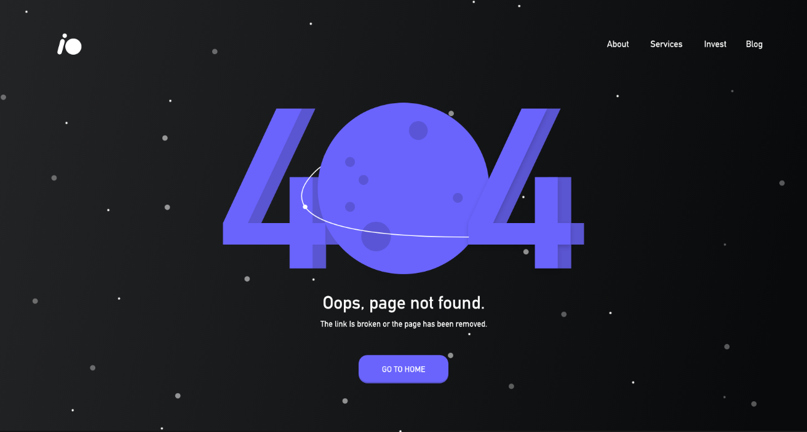

# Challenge 6 - FW7

## 📅 10/02/2020 - 14/02/2020

**Heyyyy muchachos, de buenas?** 😊,
e aí me conta, como foi o último desafio?

"_super de boas, passa um mais cabreiro._" 💪

Calma aí meu crânio de ferro, segura a emoção hehe. Vamos manter na _primeirinha_ por enquanto, é só questão de tempo até começarmos a construir umas aplicações bem mais complexas, até lá use esses **challenges** como prato de entrada. 🤤

Sem mais delongas, vamos ao **2º challenge do mês de fevereiro.**

Go go go. 👌

---

## Informações úteis

- Este **challenge** acompanha uma pasta de `assets` que contém alguns arquivos que serão necessários para a solução do desafio.

- Lembre-se de ler a regras gerais no [README](../README.md), pois não será tolerado desculpinhas depois. 😅

- Cada participante irá fazer a sua versão e publicar em seu _github_, no final da semana será "recolhido" todos os respositórios e anexados neste **doc**.

- Será escolhido pelos participantes a melhor solução e o resultado será publicado aqui mesmo.

- Qualquer dúvida já sabe né, só por na caixinha branca 🗑️ de questionamentos localizada na cozinha.

---

## Challenge

Então galera, vamos continuar na mesma pegada do [**Challenge 5**](../challenge-5/README.md), vamos focar em criação de interface.

Para esse **challenge** vamos criar uma interface de _404 page not found_, ou seja, replicar essa interface utilizando apenas **HTML** e **CSS** puro.

---

## Regras

- Fazer o uso somente de **HTML** e **CSS** puro, não utilizar _lib_ de terceiros.

- O resultado final deverá estar publicado para visualização de todos os participantes. Uma sugestão seria usar o [Surge](https://surge.sh/) pela praticidade.

- Se divertir. 😄

---

## 🤯 Solução dos devs

😎 [Pablo Danilo](https://github.com/Pablo75321/UI-s/tree/master/created_404_error)

😎 [Roberto Umbelino](https://github.com/robertoumbelino/ui/tree/master/%233)

---

É galerisss chegamos ao final de mais um desafio, fico no aguardo e ansioso para ver as vossas soluções.

Até a próxima semana, beijuuu. 😜

by [Roberto Umbelino](https://github.com/robertoumbelino)
