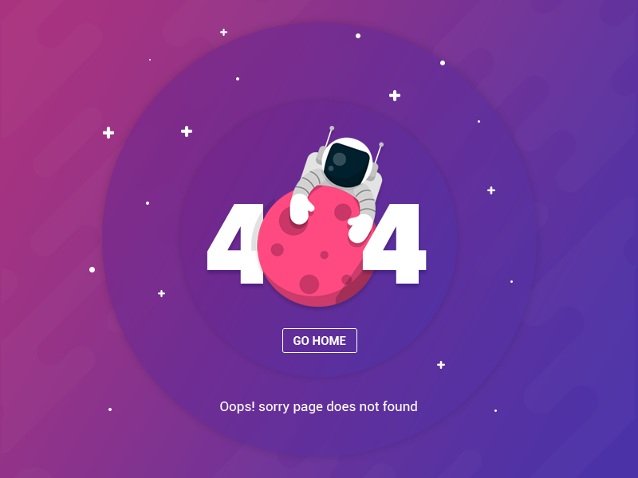

# Challenge 7 - FW7

## 📅 17/02/2020 - 21/02/2020

**Fala meus compatriotas, tudo na tranquilidade?** 😁,
pô esse mês de fevereiro está passando muito rápido né, já estamos chegando no **3º desafio do mês**. Deu tudo certo no **último desafio**? estão pronto para o **novo**?

"_sim cara, pode mandar._" 🤙

Bahh é assim que se fala 😉, já estava ficando ansioso para construção do **novo challenge**, como já é de conhecimento de todos vocês, nesse mês estamos focando nas _skills_ de **HTML** e **CSS**, logo esse **challenge** também vai consistir em uma _interface_ novinha para construirmos.

Enfim, chega de bate-papo e bora para o **3º challenge do mês de fevereiro.** 🙌

Here we go. 👻

---

## Informações úteis

- Este **challenge** acompanha uma pasta de `assets` que contém alguns arquivos que serão necessários para a solução do desafio.

- Lembre-se de ler a regras gerais no [README](../README.md), pois não será tolerado desculpinhas depois. 😅

- Cada participante irá fazer a sua versão e publicar em seu _github_, no final da semana será "recolhido" todos os respositórios e anexados neste **doc**.

- Será escolhido pelos participantes a melhor solução e o resultado será publicado aqui mesmo.

- Qualquer dúvida já sabe né, só por na caixinha branca 🗑️ de questionamentos localizada na cozinha.

---

## Challenge

Entonces mi joven, vamos realizar mais uma construção de uma _interface_ bem **top** 🔝.
Vai seguir no mesmo estilo do [**Challenge 6**](../challenge-6/README.md), uma _interface_ de _404 page not found_.

Para esse **challenge** vamos criar uma _interface_ de _404 page not found_, ou seja, vamos dar vida a essa _interface_ fazendo o uso de apenas **HTML** e **CSS** puro.

---

## Regras

- Fazer o uso somente de **HTML** e **CSS** puro, não utilizar _lib_ de terceiros.

- O resultado final deverá estar publicado para visualização de todos os participantes. Uma sugestão seria usar o [Surge](https://surge.sh/) pela praticidade.

- Se divertir. 😄

---

## 🤯 Solução dos devs

😎 [Pablo Danilo](https://github.com/Pablo75321/UI-s/tree/master/created_404_error_2)

😎 [Roberto Umbelino](https://github.com/robertoumbelino/ui/tree/master/%234)

😎 [Vinicius Axt](https://github.com/viniaxt/UI/tree/master/challenge-7)

😎 [Anderson Espindola](https://github.com/andersonespindola/FW7_Challenges/tree/master/challenger-7)

---

Ao som de [Kick Out the Windows](https://open.spotify.com/track/6Q04NQKyB5x3Ge5TRyfZT1?si=0foHwr9LSUCMwEOYo0Akvg) eu finalizo esse **penúltimo** desafio do mês, espero que vocês tenham gostado do que vamos fazer. 🙈

Vou ficar no aguardo de vocês, até a semana que vem, valeeeu. 👊

by [Roberto Umbelino](https://github.com/robertoumbelino)
