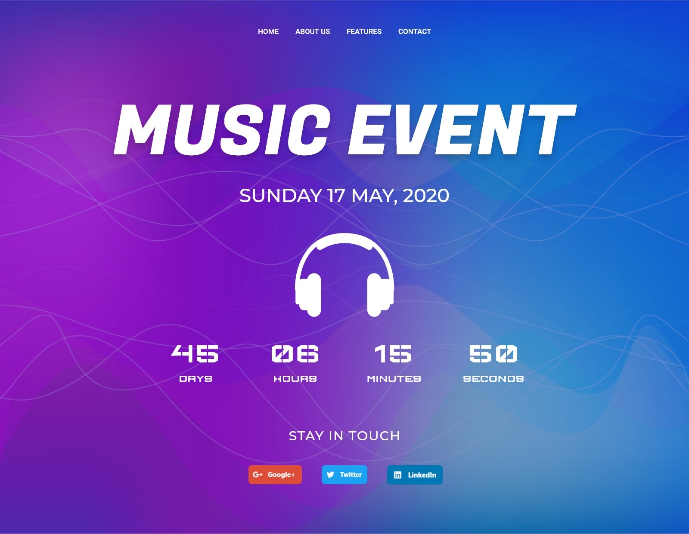

# Challenge 8 - FW7

## 📅 24/02/2020 - 28/02/2020

🎵 Challenge music: [Roadblock (feat. Craigy-T)](https://www.youtube.com/watch?v=Ot_3mupsU7o)

**Dê play na música acima e vem comigo.** 🤘

Galeriss do céu já chegamos no último _challenge_ do mês, caramba como passou rápido 😕, não vamos deixar a peteca cair agora no finalzinho, então bora terminar esse mês de fevereiro com louvor! Blz? 😁

Então... esse é o momento de me darem um _feedback_ sobre os desafios, o que acharam e tals, fazer o famoso **DAKI (drop, add, keep, improve)**, Toppen? Estou aguardando o _feedback_ de vós.

Como tinhámos combinado, esse mês seria somente de _interfaces_, logo no último _challenge_ não será diferente 😆, mas tenho total certeza que vocês não teram problema algum para resolver 🙌.

Vámonos muchachos. 🌚

---

## Informações úteis

- Este **challenge** acompanha uma pasta de `assets` que contém alguns arquivos que serão necessários para a solução do desafio.

- Lembre-se de ler a regras gerais no [README](../README.md), pois não será tolerado desculpinhas depois. 😅

- Cada participante irá fazer a sua versão e publicar em seu _github_, no final da semana será "recolhido" todos os respositórios e anexados neste **doc**.

- Será escolhido pelos participantes a melhor solução e o resultado será publicado aqui mesmo.

- Qualquer dúvida já sabe né, só por na caixinha branca 🗑️ de questionamentos localizada na cozinha.

---

## Challenge

Para este desafio será construído uma _interface_ de _Music Event_, exibindo a data do evento e quanto tempo resta para o início. De buenas, no? 😜

Bora _codar_ essa _interface_ que está mumuzinho. 🐮🥛

---

## Regras

- Fazer o uso somente de **HTML** e **CSS** puro, não utilizar _lib_ de terceiros.

- O resultado final deverá estar publicado para visualização de todos os participantes. Uma sugestão seria usar o [Surge](https://surge.sh/) pela praticidade.

- Se divertir. 😄

---

## 🤯 Solução dos devs

😎 [Pablo Danilo](https://github.com/Pablo75321/UI-s/tree/master/created_music_event_interface)

😎 [Roberto Umbelino](https://github.com/robertoumbelino/ui/tree/master/%235)

---

É galera, é aqui eu me despeço de vocês, de verdade espero que todos tenham aprendido algo novo e que tenham **curtido** tudo isso. Espero que isso seja somente o começo de muitos _challenges_, quero _codar_ aplicações completas com vocês.

Vamos chegar lá. 👊

by [Roberto Umbelino](https://github.com/robertoumbelino)
